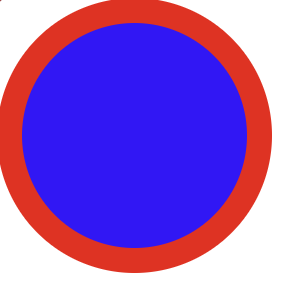

# Graphics Project
2025 Summer Software Dev (CSC 231) Graphics Project\
Contributors: Professor Brewster, Drew, Amos, Ricky

## Purpose
Draw different shapes by using SVG.

## Usage
Create an SVG file, create different shapes and draw the shapes
```c++
Svg svg_file{"example.svg", 1920, 1080};

Circle circle{100, 110, 110, 20, "red", "blue"};
circle.draw(svg_file);

svg_file.output();
```


## SVG Creation and Output
Constructor:
```c++
Svg(std::string filename, int canvas_height, int canvas_width);
```
This creates the canvas that allows you to draw shapes with a name and canvas size.

For example:
```c++
Svg svg_file{"example.svg", 1920, 1080}; 

// draw shapes here

svg_file.output();
```

## Shapes
The shapes you can draw:
- Rectangle
- Circle
- Line
- Triangle
- Text

The default attributes are the same for every shape.

```c++
std::string stroke_color{"black"};
int stroke_width{3};
std::string fill_color{"black"};
```
Each shape also has a move function and draw function:
```c++
void draw(Canvas& c);
void move(int x_move, int y_move);
```

### Rectangle
Constructors:
```c++
Rectangle(int height, int width, int x, int y);
Rectangle(int height, int width, int x, int y, int stroke_width, const std::string& stroke_color, const std::string& fill_color);
```
### Circle
Constructors:
```c++
Circle(int radius, int x, int y);
Circle(int radius, int x, int y, int stroke_width,const std::string& stroke_color, const std::string& fill_color);
```

### Line
Constructors:
```c++
Line(int start_x, int start_y, int end_x, int end_y );
Line(int start_x, int start_y, int end_x, int end_y, int stroke_width, const std::string& stroke_color);
```
